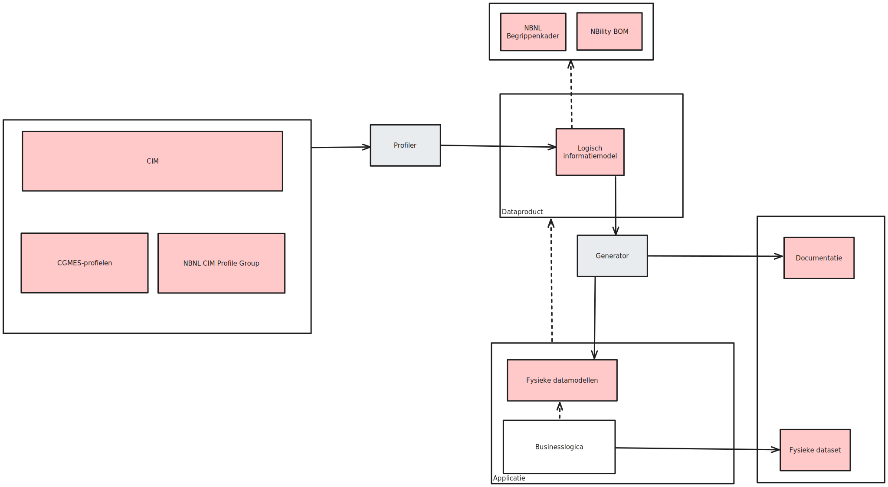

# Gestandaardiseerde dataproducten voortbrengen met LinkML

## Werkzaamheden
Vanuit de werkgroep Semantische Interoperabiliteit wordt de *NBNL-profielgroep* gedefinieerd. Voor het uitdrukken van de profielen wordt LinkML gebruikt. Het is daarmee een mooie usecase ...

### Vastlegging van dataproducten
DX-PROF/DCAT/...

Ook: wat verwachten we erin? Vastleggen met LinkML-schema.

#### Gestandaardiseerde, formele beschrijving van dataproducten
Machineleesbaar, maar inclusief mensvriendelijke documentatie.

#### URI-strategie voor dataproducten en de erbij horende logische informatiemodellen

### Bruikbaarheid vergroten van conceptuele informatiemodellen en begrippenmodellen

#### CIM
* LinkML-schema's voor het CIM.
    * Hier is een stevig begin aan gemaakt. De schema's zijn hier te vinden.
    * De correctheid en compleetheid van de schema's dient verder te worden verbeterd.
    * De gemaakte aannames en ervaren uitdagingen bij het genereren van de schema's moeten nog worden gedocumenteerd.
    * Metadata als versieinformatie dient nog te worden verrijkt.
* Hoogwaardige documentatie.
    * Webdocumentatie gebaseerd op de documentatiegenerator van LinkML.
    * Interactieve graafvisualisatie.
* Dereferenceable URI's.
    * URI's dereferenceable maken zodat de definitie en documentatie van de termen via standaard HTTP-verzoeken op te vragen is. Dit zal in samenwerking met mensen uit de CIM-gemeenschap.

#### CGMES
* LinkML-schema's voor CGMES.
    * Hier is een stevig begin aan gemaakt. De schema's zijn hier te vinden.
    * De correctheid en compleetheid van de schema's dient verder te worden verbeterd.
    * De gemaakte aannames en ervaren uitdagingen bij het genereren van de schema's moeten nog worden gedocumenteerd.
    * Metadata als versieinformatie dient nog te worden verrijkt.

#### Netbeheer Nederland-begrippenkader
* URI-strategie opstellen.
* Nieuwe URI's toekennen aan de begrippen.
* URI's dereferenceable maken zodat de definitie en documentatie van de begrippen via standaard HTTP-verzoeken op te vragen is.

### Profileren van (referentie)schema's
Het profileren van LinkML-schema's, ongeacht wat voor type model erin beschreven is.

#### Uitbreiden en verbeteren van LinkML Profiler.
* Functionaliteiten uitbreiden.
* Softwarekwaliteit verbeteren.

#### Grafische web-ui voor LinkML Profiler
* Frontend bouwen.
* Backend bouwen.

### Gestandaardiseerd definiëren van wat een dataproduct is

### Bouwen van dataproducten en data-applicaties m.b.v. LinkML

## Usecases
Het definiëren van de NBNL Profile Group is de usecase

### Vastlegging formele definitie van wat een dataproduct is

#### Omschrijving
De definitie van wat een dataproduct is dient formeel vastgelegd te worden door een datamodel op te stellen op basis van een referentiestandaard als [DCAT](https://www.w3.org/TR/vocab-dcat-3/) of DX-PROF. In het bijzonder kan gekeken worden naar reeds bestaande toepassingsprofielen op basis van DCAT gemaakt door de [EU](https://semiceu.github.io/DCAT-AP/releases/3.0.0/) en de [Nederlandse overheid](https://data.overheid.nl/en/ondersteuning/open-data/dcat).

Een machineleesbaar, formeel model:
* neemt veel discussie weg;
* maakt validatie van dataproductdefinities mogelijk;
* maakt generatie van (deel van de) documentatie mogelijk.

Dit datamodel kan in LinkML worden opgesteld met expliciete referenties naar de gebruikte termen uit de gewenste standaarden. Een voorbeelduitwerking van een in LinkML gedefinieerde, op DCAT-gebaseerde dataproductdefinitie voor Alliander kan [hier](https://github.com/Alliander/aim--dataproduct) worden raadgepleegd.

Aanvullend dient mensvriendelijke documentatie te worden geschreven over wat een dataproduct is. Voor de hand ligt om gegenereerde documentatie te daarmee verrijken.

#### Deliverables

* een formeel datamodel dat beschrijft wat in een dataproduct bevat is, inclusief beperkingen;
* (mensvriendelijke) documentatie.

#### Acceptatiecriteria
TODO.

### Eenduidige werkwijze en heldere documentatie voor het maken en beheren van dataproducten

#### Omschrijving
TODO.

#### Deliverables
TODO.

#### Acceptatiecriteria
TODO.

### Verbeterde interactieve documentatie van het CIM

#### Omschrijving
TODO.

#### Deliverables
TODO.

#### Acceptatiecriteria
TODO.

### Verbeterde interactieve documentatie van het CIM

#### Omschrijving
TODO.

#### Deliverables
TODO.

#### Acceptatiecriteria
TODO.
