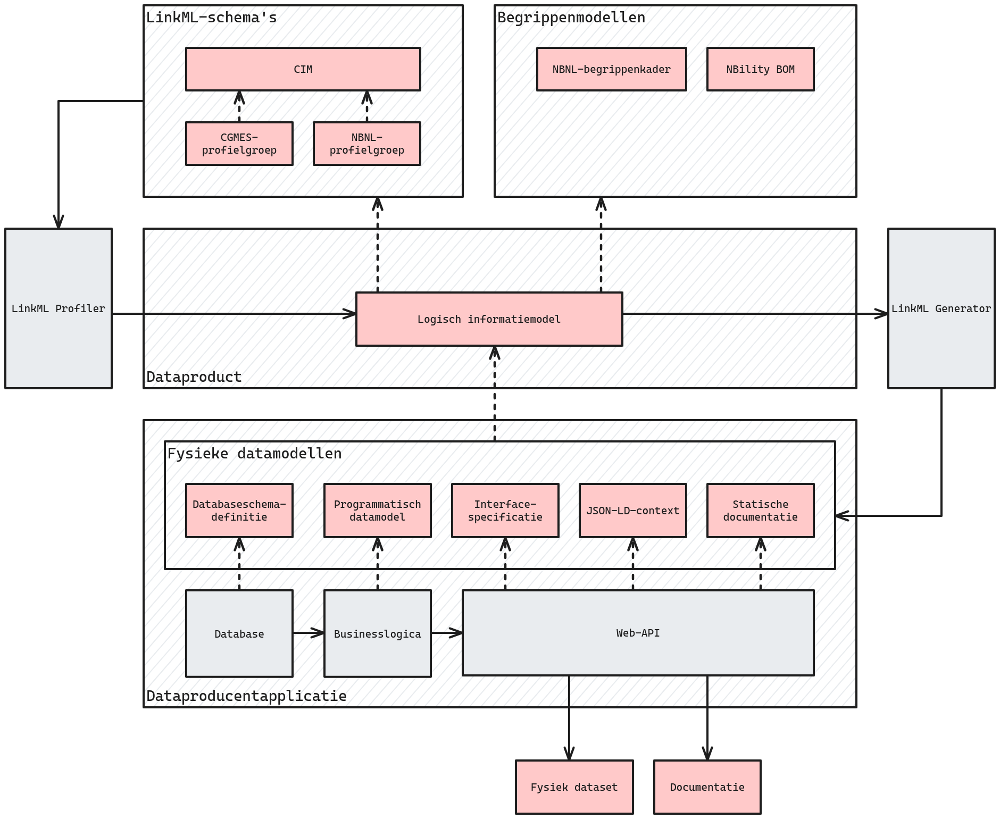

# FAIR dataproducten maken met LinkML

## Inleiding

In dit document worden werkzaamheden voorgesteld teneinde het maken van FAIR dataproducten mogelijk te maken op uniforme, gestandaardiseerde en toegankelijke wijze. Hierbij zal LinkML als middel centraal staan.

Het werk omvat het beschrijven van definities, processen en werkwijzen; het bouwen en uitbreiden van benodigde software; en het verbeteren van referentiemodellen en de documentatie daarvan. Zie [Werkzaamheden](#Werkzaamheden) voor meer details.

Dit werk zal zich direct nuttig maken bij het opstellen van de [NBNL-profielgroep](https://github.com/Netbeheer-Nederland/doc-design-wg-sem-int), alsook zich laten voeden door de concrete vragen en uitdagingen die daar ervaren zullen worden.

## Executive summary

Alvorens dataproducten te kunnen maken is een formele vastlegging van wat onder een dataproduct verstaan wordt benodigd. Een formele beschrijving gebaseerd op een referentiemodel als DCAT of DX-PROF is daarbij wenselijk.

Een onmiskenbaar en belangrijk onderdeel van een dataproduct is het logisch informatiemodel dat de structuur van de data erin beschrijft. Voor de vastlegging daarvan wordt LinkML gebruikt: een toegankelijke Linked Data-modelleertaal die mogelijkheden biedt om de betekenis van data expliciet te maken door verwijzingen naar referentiemodellen. Het is daarmee een uitermate geschikt middel om data FAIR mee te maken.

Verder komt LinkML met een ecosysteem aan software dat ondersteunt bij het maken van dataproducten, met name een tal van generatoren die mogelijk maken om fysieke datamodellen, documentatie en overige artefacten te genereren. Dit is enorm behulpzaam bij het realiseren van de technische implementatie van de dataservice die het dataproduct aan gaat bieden.

Wellicht de grootste uitdagingen komen echter vanuit het informatiemodelleringsperspectief. Het domein is complex en het modelleren van een usecase is moeilijk. Bovendien is het wenselijk dit FAIR te doen, wat bijvoorbeeld vraagt om termen uit referentiemodellen te gebruiken en een doordachte URI-strategie voor globale identificatie te hanteren.

Om het modelleren van usecases eenvoudiger te maken zijn een aantal referentiemodellen (zoals het CIM en de CGMES-profielgroep) geconverteerd naar LinkML-schema's, zodat op basis daarvan schema's kunnen worden opgesteld waaraan vervolgens structuur en beperkingen kunnen worden toegevoegd om uitdrukking te geven aan de usecase.

Nog meer hulp kan worden verkregen door het gebruik van de LinkML Profiler. Dit is een applicatie waarmee een gegeven LinkML-schema kan worden geprofileerd, d.w.z. er wordt een snede uit het schema gemaakt. De gebruiker geeft een of meerdere klassen op en de profiler genereert een schema met enkel die klassen (en alle afhankelijkheden ervan).

---

## Werkzaamheden

### Vastlegging van dataproducten

TODO. (Refereer aan plaatje.)

#### :ballot_box_with_check: Gestandaardiseerde, formele beschrijving van dataproducten

##### Omschrijving

De definitie van wat een dataproduct is dient formeel vastgelegd te worden door een datamodel op te stellen op basis van een referentiestandaard als [DCAT](https://www.w3.org/TR/vocab-dcat-3/) of DX-PROF. In het bijzonder kan gekeken worden naar reeds bestaande toepassingsprofielen (application profiles, of AP) op basis van DCAT gemaakt door de [EU](https://semiceu.github.io/DCAT-AP/releases/3.0.0/) en de [Nederlandse overheid](https://data.overheid.nl/en/ondersteuning/open-data/dcat).

Een machineleesbaar, formeel model:

- neemt veel discussie weg;
- maakt validatie van dataproductdefinities mogelijk;
- maakt generatie van (deel van de) documentatie mogelijk.

Dit datamodel kan in LinkML worden opgesteld met expliciete referenties naar de gebruikte termen uit de gewenste standaarden. Een voorbeelduitwerking van een in LinkML gedefinieerde, op DCAT-gebaseerde dataproductdefinitie voor Alliander kan [hier](https://github.com/Alliander/aim--dataproduct) worden raadgepleegd.

Aanvullend dient mensvriendelijke documentatie te worden geschreven over wat een dataproduct is. Voor de hand ligt om gegenereerde documentatie te daarmee verrijken.

##### Deliverables

- een op standaarden gebaseerde formele beschrijving in de vorm van een logisch informatiemodel van wat een wat een dataproduct is;
- (mensvriendelijke) documentatie.

#### :ballot_box_with_check: URI-strategie voor dataproducten en profielen

##### Omschrijving

Dataproducten, de daarbij horende logische informatiemodellen, profielen en wellicht zelfs profielgroepen dienen globaal identificeerbaar te zijn via URI's. Dit maakt mogelijk ze te catalogiseren en eenduidig naar ze te verwijzen, wat bijvoorbeeld cruciaal is voor datamanagement en datagovernance.

Het is daarbij van belang de volgende nuance te belichten. Stel, in een LinkML-schema definieer ik een klasse met zekere beperkingesregels, waarbij ik een (semantische) verwijzing naar een klasse in een referentiemodel opneem. Merk dan op dat de beperkende klassedefinitie in LinkML een andere resource is dan de klasse waarnaar wezen wordt, en dat beide dus een andere URI hebben.

Er is veel reeds verricht werk voor hoe URI's op te stellen, zowel nationaal als internationaal. Het is wijsheid op dat werk voort te borduren.

##### Deliverables

* Documenten waarin beschreven staat wat de URI-strategie is voor:
  
   * profielen;
  
   * dataproducten;
  
   * logische informatiemodellen van dataproducten.

### Bruikbaarheid vergroten van referentiemodellen

TODO.

#### :ballot_box_with_check: CIM: LinkML-schema's en documentatie verbeteren

##### Omschrijving

Het CIM is effectief een gestructureerd vocabulair waarin decennialange domeinexpertise is vastgelegd. Helaas is de bruikbaarheid van dit informatiemodel belemmerd doordat het informatiemodel beheerd wordt in een commerciële applicatie waar interoperabiliteit niet voor de hand ligt.

Verder is de documentatie van het CIM niet gebruiksvriendelijk, met name niet voor hen die niet gewend zijn aan het doorlezen van formele specificaties.

###### Verbetering kwaliteit van LinkML-schema's

Er is reeds werk verricht om het CIM in LinkML-schema's te representeren. De correctheid en compleetheid van de schema's dient verder te worden verbeterd. Daarbij is het van belang de gemaakte aannames en ervaren uitdagingen bij het genereren van de schema's te documenteren. Tot slot mogen de schema's met meer metadata verrijkt worden zoals versieinformatie.

###### Gebruiksvriendelijke documentatie

Zoals gezegd is de huidige documentatie van het informatiemodel niet gebruiksvriendelijk. Het zou helpen webdocumentatie te verzorgen, waarbij als basis de statisch gegenereerde documentatiebestanden van LinkML kunnen worden genomen.

Indien gewenst kunnen andere, visuele vormen van documentatie worden verkend. Denk hierbij met name aan een interactieve graafvisualisatie, die het perspectief van ontdekken vanuit een bekend startpunt benadrukt.

###### Dereferenceable URI's

In de filosofie van Linked Data is het idee om URI's dereferenceable te maken zodat de definitie en documentatie van de termen via standaard HTTP-verzoeken op te vragen is. Dit zal gerealiseerd worden in samenwerking met mensen uit de CIM-gemeenschap.

##### Deliverables

* LinkML-schema's voor het CIM van een volwassenheidsniveau dat ze bruikbaar maakt voor het opstellen van profielen en dataproducten;

* Gebruiksvriendelijke documentatie, publiek beschikbaar via het WWW;

* Dereferenceable URI's teneinde termen zelfbeschrijvend te maken, waarbij de implementatie content-negotiation ondersteunt zodat zowel een machineleesbare als mensvriendelijke representatie van de beschrijving opgehaald kan worden.

#### :ballot_box_with_check: CGMES: LinkML-schema's verbeteren

Ook voor CGMES zijn LinkML-schema's gegenereerd. Vergelijkbaar met de uitleg voor het CIM hierboven, geldt dat de kwaliteit van de schema's mag worden verbeterd, alsook dat de gemaakte aannames en ervaren uitdagingen bij het genereren van de schema's mogen worden gedocumenteerd en de metadata mag worden verrijkt.

##### Deliverables

- LinkML-schema's voor het CIM van een volwassenheidsniveau dat ze bruikbaar maakt voor het opstellen van profielen en dataproducten.

---

#### Netbeheer Nederland-begrippenkader

* URI-strategie opstellen.
* Nieuwe URI's toekennen aan de begrippen.
* URI's dereferenceable maken zodat de definitie en documentatie van de begrippen via standaard HTTP-verzoeken op te vragen is.

### Profileren van (referentie)schema's

Het profileren van LinkML-schema's, ongeacht wat voor type model erin beschreven is.

#### Uitbreiden en verbeteren van LinkML Profiler.

* Functionaliteiten uitbreiden.
* Softwarekwaliteit verbeteren.

#### Grafische web-ui voor LinkML Profiler

* Frontend bouwen.
* Backend bouwen.

### Bouwen van dataproducten en data-applicaties m.b.v. LinkML

---

#### Eenduidige werkwijze en heldere documentatie voor het maken en beheren van dataproducten

##### Omschrijving

TODO.

##### Deliverables

TODO.

##### Acceptatiecriteria

TODO.

### 
